# ファイル間の依存関係

ビルドターゲットごとに、どのファイルがどれを include するかを示す。
用語 (部分ゲーム / 展開器 / 判定器 / org / rnd など) は `CONTEXT.md` を参照。

## 層の構造

下の層ほど依存が少ない。上の層は下の層にしか依存しない。

```mermaid
graph TD
  subgraph L4["ターゲットごとの main"]
    cfr_cpp[cfr.cpp]
    cfr_zero_cpp[cfr_zero.cpp]
    cfr_org_cpp[cfr_org.cpp]
    br_cpp[br.cpp]
    br_rnd_cpp[br_rnd.cpp]
    infset_iswin_cpp[infset_iswin.cpp]
  end
  subgraph L3["展開器と判定器"]
    org_tree[org_tree.hpp]
    visit_winlose[visit_winlose.hpp]
    rnd_make_infset[rnd_make_infset.hpp]
    infset_dfs[infset_dfs.hpp]
    infset_dfs_rnd[infset_dfs_rnd.hpp]
    all_elements[all_elements.hpp]
    all_elements_rnd[all_elements_rnd.hpp]
    cfr_hpp[cfr.hpp]
    cfr_exp_reward[cfr_exp_reward.hpp]
    bf_position[bf_position.hpp]
  end
  subgraph L2["ゲームの表現"]
    loveletter_hpp[loveletter.hpp]
    loveletter_cpp[loveletter.cpp]
    org_seq[org_action_sequense.*]
    rnd_seq[rnd_action_sequense.*]
  end
  subgraph L1["共有宣言"]
    action_code[action_code.hpp / .cpp]
    run_mode[run_mode.hpp]
    analysis_points[analysis_points.hpp]
    card_table[card_table.hpp]
  end
  subgraph L0["gperf 生成物"]
    org_action[org_action.hpp]
    rnd_action[rnd_action.hpp]
  end

  L4 --> L3
  L3 --> L2
  L2 --> L1
  L1 --> L0
```

## 共有宣言の層

各 `.cpp` が `extern` を手書きでコピーするのをやめ、宣言はここに集約している。
**定義**は初期値がプログラムごとに違うため各 main の `.cpp` に残してある
(理由は `docs/adr/0004-shared-declarations-headers.md`)。

| ヘッダ | 中身 | 定義の場所 |
|---|---|---|
| `action_code.hpp` | 行動 ↔ `unsigned char` 1文字 の変換6本、gperf ハッシュ表 `rph` / `oph` | `action_code.cpp` (変換6本)、ヘッダ内の `inline` 変数 (`rph` / `oph`) |
| `run_mode.hpp` | `cfr_switch` `cfr_player` `br_switch` `br_player` `org_switch` | 各 main の `.cpp` |
| `analysis_points.hpp` | `p1_points` `rand_points` `win_points` `decision_points` などの統計 | 各 main の `.cpp` |
| `card_table.hpp` | `max_num` (カードの枚数)、`table_sign` `action_sign` `card_sign` | ヘッダ内の `inline constexpr` |

## ターゲットごとの構成

`COMMON_SRCS` = `loveletter.cpp` `rnd_action_sequense.cpp` `org_action_sequense.cpp` `action_code.cpp`
は全ターゲット共通でリンクされる。下表はそれに加えて必要なもの。

| ターゲット | main | 固有の依存 |
|---|---|---|
| `cfr` | `cfr.cpp` | `cfr_exp_reward.hpp` `rnd_make_infset.hpp` `cfr.hpp` |
| `cfr0` | `cfr_zero.cpp` | `rnd_make_infset.hpp` |
| `cfrorg` | `cfr_org.cpp` | `org_tree.hpp` `visit_winlose.hpp` → `bf_position.hpp` |
| `brorg` | `br.cpp` | `all_elements.hpp` `rnd_make_infset.hpp` `infset_dfs.hpp` |
| `brrnd` | `br_rnd.cpp` | `all_elements_rnd.hpp` `rnd_make_infset.hpp` `infset_dfs_rnd.hpp` |
| `win` | `infset_iswin.cpp` | `save_load_abshistory.hpp` `rnd_make_infset.hpp` `bf_position.hpp` |
| `comp` | `compare_abscfr.cpp` | `all_elements_rnd.hpp` `rnd_make_infset.hpp` `infset_dfs.hpp` `save_load_abshistory.hpp` `bf_position.hpp` |
| `end` | `endgame.cpp` | `endgame.hpp` → `bs_set.hpp` (`COMMON_SRCS` を使わない単独ビルド) |
| `test` | `test.cpp` | `bf_position.hpp` + `action_code.cpp` (gitignore 済みのスクラッチ) |

`watch` は `watch_cfr.cpp` が `cfr_switch` を定義していないためリンクできない (既知)。
`brrnd` は `br_rnd.cpp` が読む `ave_prob_action<部分ゲーム><t>.bin` を書き出すコードが
存在しないため実行できない (既知)。ビルドは通る。

## org と rnd の対応

| | org | rnd |
|---|---|---|
| 行動列 | `org_action_sequense.*` | `rnd_action_sequense.*` |
| gperf ハッシュ | `org_action.hpp` (`oph`) | `rnd_action.hpp` (`rph`) |
| 全節点列挙 | `all_elements.hpp` | `all_elements_rnd.hpp` |
| 最適反応 | `infset_dfs.hpp` | `infset_dfs_rnd.hpp` |
| 木の展開 | `org_tree.hpp` | `rnd_make_infset.hpp` |
| 必勝・必敗判定 | `visit_winlose.hpp` | `infset_iswin.cpp` |

最後の2行だけ形が違う。org は展開器 (`org_tree.hpp`) と判定器 (`visit_winlose.hpp`) を
分離し、展開の途中で判定を呼ぶ。rnd は情報集合表を作ってから舐める二相構成。
org を二相にできない理由は `docs/adr/0001-no-infset-table-in-org.md` を参照。

この非対称のため、`org_tree.hpp` は統計カウンタも `table_infset` も使わず
何も include しないが、`rnd_make_infset.hpp` は統計カウンタを直接使うので
`analysis_points.hpp` を include する。揃えてはいけない。
